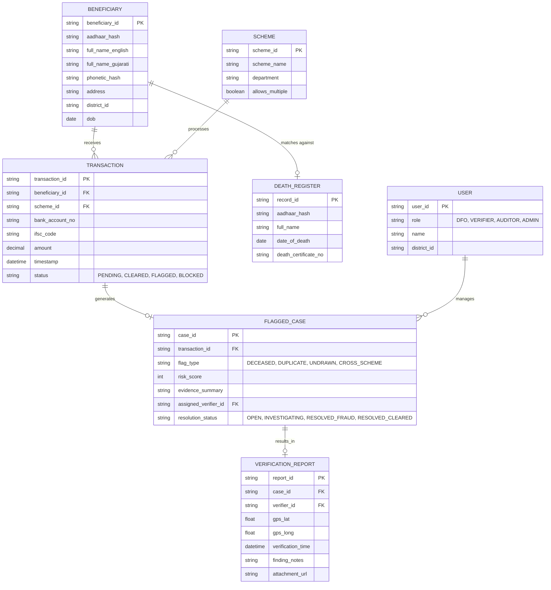

# DBT Leakage Detection System: Data Models & ER Diagram

This document defines the underlying data structures required to support high-speed processing and robust audit trails.

## 1. Entity Relationship Diagram

## 2. Key Data Entities

### 2.1 BENEFICIARY
Stores the core demographic data of individuals enrolled in any scheme.
*   **aadhaar_hash:** Aadhaar numbers must be encrypted or hashed at rest for security compliance.
*   **phonetic_hash:** A pre-calculated phonetic representation of the Gujarati name to drastically speed up transliteration-aware duplicate detection during real-time processing.

### 2.2 TRANSACTION
The primary high-volume table representing individual disbursement events.
*   Must be highly optimized for fast inserts and reads.
*   **status:** Tracks the lifecycle. Starts as PENDING, immediately moves to CLEARED if no rules trigger, or FLAGGED if anomalies are detected.

### 2.3 FLAGGED_CASE
The core entity for the DFO workflow. Extracted from raw transactions to create a structured investigation queue.
*   **risk_score:** An integer (0-100) representing the severity and confidence of the flag.
*   **evidence_summary:** A serialized JSON or structured string explaining exactly *why* the score was given, ensuring explainability.

### 2.4 VERIFICATION_REPORT
Stores the immutable ground-truth data collected by Verifiers.
*   **gps_lat / gps_long:** Critical fields to mathematically prove the Verifier was within a certain radius of the beneficiary's registered address.

## 3. Database Strategy for Performance
To meet the benchmark of processing 10,000+ transactions in under 30 seconds:
*   **In-Memory Caching:** The `DEATH_REGISTER` and recent `BENEFICIARY` phonetic hashes should be loaded into an in-memory datastore (like Redis) prior to batch processing to prevent disk I/O bottlenecks.
*   **Indexing:** Heavy indexing on `aadhaar_hash`, `phonetic_hash`, and `bank_account_no`.
*   **Partitioning:** The `TRANSACTION` table should be partitioned by date or month to maintain query speed as the dataset grows over years.
