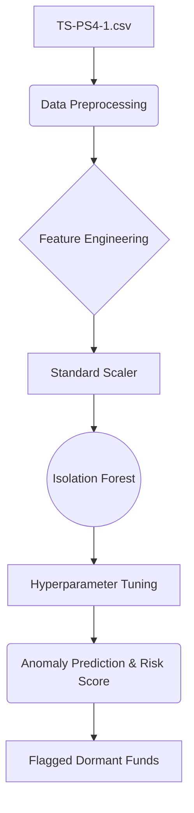
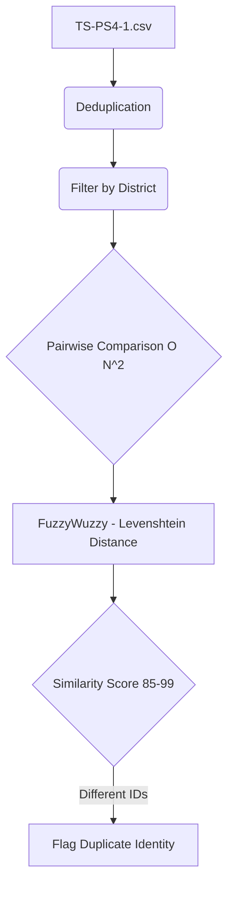
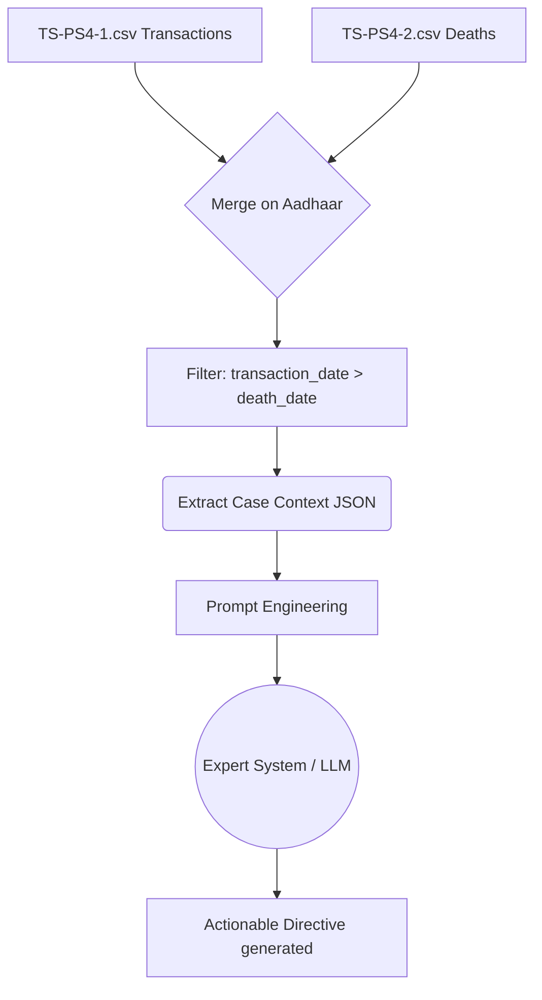
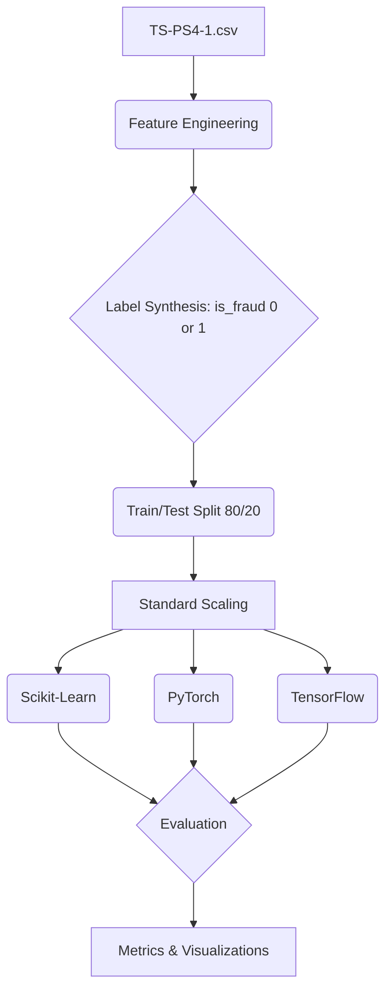

# DBT Leakage Detection System - Model Workflows

This document explains the workflow, data ingestion, and processing steps for each of the analytical models implemented in the DBT Leakage Detection System.

## Model A: Behavioral Anomaly Detection (Isolation Forest)
**Location:** `notebooks/01_isolation_forest_dormant_funds.ipynb`
**Goal:** Detect dormant funds anomalies where beneficiaries receive funds but never withdraw them.

### Data Travel & Workflow:

1. **Data Ingestion:** Reads the transactional dataset (`TS-PS4-1.csv`) containing records of fund disbursements.
2. **Preprocessing & Feature Engineering:**
   - Cleans the data by dropping records with missing values for `amount`, `withdrawn`, or `beneficiary_id`.
   - Aggregates the data at the `beneficiary_id` level to engineer key behavioral features: `total_transactions`, `total_amount`, and `withdrawal_rate`.
   - Standardizes the engineered features using `StandardScaler` to ensure a uniform scale for the anomaly detection algorithm.
3. **Model Execution:**
   - Employs an **Isolation Forest**, which is an unsupervised machine learning algorithm designed to isolate anomalies.
   - Performs hyperparameter tuning to find the optimal `contamination` rate to correctly identify severe anomalies without generating massive false positives.
4. **Output Generation:** 
   - Assigns an anomaly prediction (-1 for anomalous, 1 for normal) to each beneficiary.
   - Calculates a normalized `risk_score` from 0 to 100 based on the model's decision function.
   - Flags critical dormant funds by filtering for beneficiaries with near-zero withdrawal rates, sorting them by the highest risk score for officer review.

---

## Model B: Duplicate Identity Detection (Transliteration Handling)
**Location:** `notebooks/02_fuzzy_transliteration_matching.ipynb`
**Goal:** Flag duplicate identities that bypass exact string matching due to regional transliteration differences (e.g., Gujarati to English spellings like "Suresh Patel" vs. "Sureshbhai Ptl").

### Data Travel & Workflow:

1. **Data Ingestion:** Reads the transactional dataset (`TS-PS4-1.csv`).
2. **Preprocessing:**
   - Deduplicates the dataset so that only one unique record per `beneficiary_id` is maintained.
   - Filters the data by `district` (e.g., Surat) to optimize computational efficiency and restrict the search space for pairwise matching.
3. **Model Execution:**
   - Uses the **Levenshtein Distance** algorithm (via the `FuzzyWuzzy` library) to calculate string similarity ratios (`fuzz.ratio` and `fuzz.token_sort_ratio`).
   - Compares beneficiary names iteratively (an O(N^2) complexity operation within the district subset) to find close matches.
4. **Output Generation:**
   - Flags beneficiary pairs with a similarity score between 85 and 99 that have different beneficiary IDs.
   - Returns a structured list of highly probable duplicate accounts for manual or automated resolution.

---

## Model C: Prescriptive AI (Actionable Suggestions)
**Location:** `notebooks/03_prescriptive_ai_suggestions.ipynb`
**Goal:** Generate human-readable, actionable suggestions for District Finance Officers based on flagged anomalies, transforming raw alerts into clear operational directives.

### Data Travel & Workflow:

1. **Data Ingestion:** Reads both the transactional dataset (`TS-PS4-1.csv`) and the civil registry / vital statistics dataset (`TS-PS4-2.csv`).
2. **Preprocessing (Deterministic Join):**
   - Merges the transactions and deaths datasets on the `aadhaar` identification field.
   - Identifies cases where a transaction occurred *after* an official death date (`transaction_date > death_date`).
   - Extracts the context of a real flagged case into a JSON-like dictionary, highlighting metrics such as the specific `flag_type`, `risk_score`, and `days_post_mortem`.
3. **Model Execution:**
   - Feeds the structured case context into an Expert System or Generative AI simulation pipeline.
   - A prompt is dynamically engineered with the alert details, simulating a query to a Large Language Model (LLM).
4. **Output Generation:**
   - The system analyzes the rules and outputs a natural language directive for the officer (e.g., "FAULT: Transfer occurred 226 days post-mortem. SUGGESTION: Immediately block funds. Do NOT dispatch field verifier...").

---

## Model D: Supervised ML Model Training & Comparison
**Location:** `notebooks/04_supervised_fraud_classification.ipynb`
**Goal:** Train, evaluate, and compare various supervised machine learning models to automatically classify fraud and anomalies based on established heuristic patterns.

### Data Travel & Workflow:

1. **Data Ingestion & Label Synthesis:**
   - Ingests the transactional dataset (`TS-PS4-1.csv`) and performs feature engineering (aggregating by `beneficiary_id` to get totals and rates).
   - **Label Synthesis:** Since explicit fraud labels are not provided in the raw dataset, the system synthesizes a target variable (`is_fraud`). A label of 1 is assigned if the withdrawal rate is exactly 0 and the total amount is significantly high; otherwise, it is 0.
2. **Preprocessing:**
   - Splits the data into an 80/20 train/test distribution.
   - Normalizes the feature inputs using standard scaling.
3. **Model Execution (Multi-Framework):**
   - **Scikit-Learn:** Trains traditional classifiers including Logistic Regression, Random Forest, and Gradient Boosting.
   - **PyTorch:** Constructs and trains a multi-layer deep neural network (`FraudNetPyTorch`) optimized with Binary Cross Entropy Loss over multiple epochs.
   - **TensorFlow/Keras:** Builds an equivalent sequential neural network to validate deep learning results across different frameworks.
4. **Evaluation & Output:**
   - Evaluates all models against the test set, computing standard classification metrics like accuracy, precision, recall, F1-score, and ROC AUC.
   - Automatically renders visualizations such as training losses and model accuracy comparisons to prove the system's analytical robustness.
