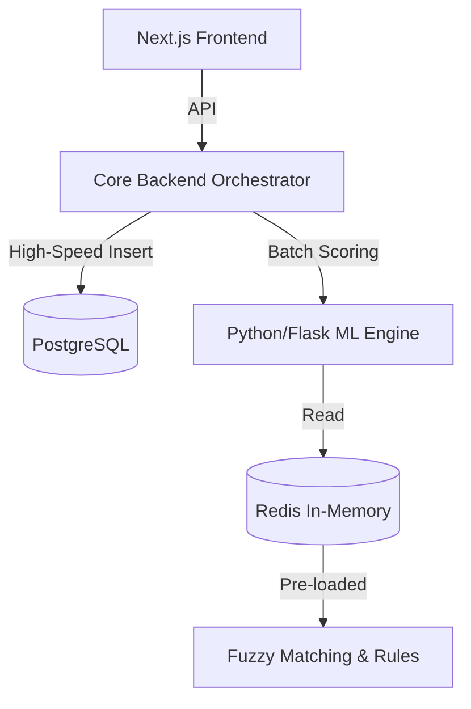

# System Overview and Architecture

> [!NOTE]
> This document explains the high-level purpose of the DBT Leakage Detection System, 
> the core architecture, and the distinct roles of its users.

## Table of Contents
- [1. Problem Statement](#1-problem-statement)
- [2. Core Objectives](#2-core-objectives)
- [3. Architecture Strategy](#3-architecture-strategy)
- [4. Technology Stack](#4-technology-stack)
- [5. User Roles and Responsibilities](#5-user-roles-and-responsibilities)

## 1. Problem Statement

Currently, Gujarat disburses funds across numerous welfare schemes. However, inherent 
vulnerabilities lead to significant financial leakages:
*   Disbursements to ineligible or deceased beneficiaries.
*   Middlemen intercepting funds via routed transfers.
*   Accumulation of unwithdrawn funds in dormant accounts.
*   Duplicate payments due to transliteration inconsistencies (e.g., Gujarati to English).

## 2. Core Objectives

*   **Proactive Anomaly Detection:** Near real-time flagging of suspicious transactions.
*   **High-Performance Processing:** Ingest 10,000+ transactions in under 30 seconds.
*   **Explainable AI:** Provide transparent risk scores with evidentiary citations.
*   **Actionable Intelligence:** Generate prioritized investigation queues.
*   **Closed-Loop Resolution:** End-to-end tracking with GPS-stamped verification.

## 3. Architecture Strategy

The system uses a decoupled, microservices-inspired architecture.

## 4. Technology Stack

### Frontend: Next.js
*   **Role-Based Dashboards:** Distinct secure routes.
*   **Server-Side Rendering (SSR):** Instant loading for large tables.
*   **API Routes:** Secure lightweight middle-tier.

### Anomaly Detection & ML Engine: Python (Flask)
*   **Data Science Ecosystem:** Pandas, NumPy, Scikit-learn.
*   **Specialized Libraries:** FuzzyWuzzy (Levenshtein distance), Double Metaphone.

### Core Backend Services: Decoupled
*   **Language Agnostic:** Node.js, Go, or Java.
*   **Responsibilities:** High-speed ingestion, database operations, and orchestration.

## 5. User Roles and Responsibilities

### District Finance Officer (DFO)
*   Monitors prioritized investigation queue.
*   Assigns cases to Scheme Verifiers.
*   Approves or halts disbursements.

### Scheme Verifier (Field Investigator)
*   Receives assignments via mobile interface.
*   Conducts on-ground physical verification.
*   Submits GPS-stamped reports.

### Audit Team Member
*   Queries cross-scheme duplicate flags.
*   Generates compliance summaries.

### State DBT Administrator
*   Configures leakage pattern rules.
*   Views state-level risk heatmap.
