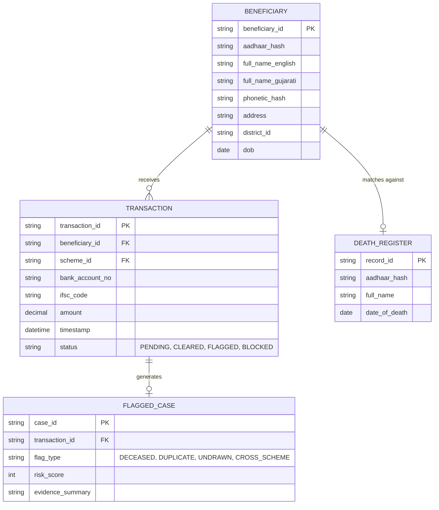

# Data Schema and ER Diagram

> [!NOTE]
> This reference document outlines the exact data schema of the simulated DBT datasets
> and provides an Entity Relationship (ER) diagram for the underlying database structure.

## Table of Contents
- [1. Entity Relationship Diagram](#1-entity-relationship-diagram)
- [2. Primary Transactions Dataset](#2-primary-transactions-dataset)
- [3. Civil Death Register Dataset](#3-civil-death-register-dataset)

## 1. Entity Relationship Diagram

## 2. Primary Transactions Dataset

Located at `data/TS-PS4-1.csv`. Contains historical and current disbursement records.

### Data Dictionary

| Field | Type | Description | Observed Mock Data Examples |
| :--- | :--- | :--- | :--- |
| `beneficiary_id` | String | Unique system ID | `B100000`, `B100001` |
| `aadhaar` | Integer | 12-digit Aadhaar Number | `223005401501` |
| `name` | String | Beneficiary Name (with transliteration variations) | `Suresh Patel`, `Suresh Ptl` |
| `scheme` | String | Welfare Scheme Identifier | `PM-KISAN`, `Pension` |
| `district` | String | Gujarat District | `Surat`, `Bhavnagar` |
| `amount` | Integer | Disbursed Amount (₹) | `1000`, `2000`, `5000` |
| `transaction_date`| Date | Date of fund transfer (YYYY-MM-DD) | `2023-07-29` |
| `withdrawn` | Boolean | `1` if funds were withdrawn, `0` if sitting dormant | `0`, `1` |
| `status` | String | Gateway status of the transaction | `SUCCESS`, `FAILED` |

## 3. Civil Death Register Dataset

Located at `data/TS-PS4-2.csv`. Represents the official vital statistics registry.

### Data Dictionary

| Field | Type | Description | Observed Mock Data Examples |
| :--- | :--- | :--- | :--- |
| `aadhaar` | Integer | 12-digit Aadhaar Number | `893725541723` |
| `name` | String | Deceased Individual's Name | `Mahesh Shah`, `Amit Joshi` |
| `death_date` | Date | Official Date of Death (YYYY-MM-DD) | `2025-11-29`, `2023-02-26` |
